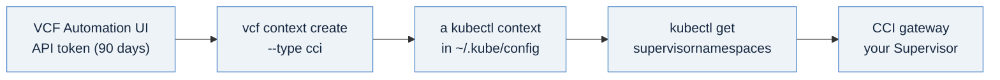

# Reaching the Supervisor: the vcf CLI, a context, and your first commands

Every template in this library assumes you can already run a command like
`kubectl get supervisornamespaces` and see a result. This page gets you to that
point from a standing start: install the CLI, authenticate once, and run your
first commands against the Supervisor. If you have a VCF Automation login but have
never reached the Supervisor from a terminal, start here, then read
[01-before-you-start](./01-before-you-start.md).

## How the pieces connect



You do not point `kubectl` at the Supervisor by hand. The **vcf CLI** does it for
you: you give it an API token, it authenticates, and it writes a ready-to-use
context into your `~/.kube/config`. From then on, plain `kubectl` is the tool.

There are two ways in. The **CCI gateway** (`https://<vcfa-fqdn>/cci/kubernetes`)
applies your VCF organization's governance and is the path these templates use.
A **direct Supervisor** login exists for cluster-admin tasks and bypasses that
governance; you do not need it here.

## Step 1: Get the vcf CLI

The `vcf` CLI is the canonical tool for Supervisor and VKS access. It does the job
the `kubectl-vsphere` plugin and the standalone `tanzu` CLI used to do; both are
legacy, so a guide built on them is a pre-9.0 workflow.

It is not preinstalled on your workstation. Two places serve it, fastest first:

- **Your Supervisor or VCF Automation portal.** In the vSphere Client, open a
  Supervisor namespace and use the **Link to CLI Tools** on its Summary tab (the
  same download page you may remember serving `kubectl-vsphere`; on 9.x it serves
  the vcf CLI). The VCF Automation tenant portal offers the same download.
- **The Broadcom Support Portal**, under your VCF release, listed as **VCF
  Consumption CLI**: a per-OS archive, plus a matching OCI plugin bundle for
  air-gapped installs.

Download the archive for your OS and architecture, verify it, and put it on your
PATH:

```bash
shasum -a 256 -c sha256sum.txt        # verify against the checksum Broadcom publishes
tar -xvzf vcf-cli.tar.gz              # (unzip the .zip on Windows)
mv vcf-cli-darwin_arm64 vcf           # the binary ships as vcf-cli-<os>_<arch>
sudo install vcf /usr/local/bin/vcf   # onto your PATH
vcf version                           # expect a v9.x build; 9.1 is current
```

There is no supported package-manager install. Homebrew, APT, YUM, DNF, and
Chocolatey are not channels for the vcf CLI, so `brew install` and its equivalents
will not find it; use the signed archive above. For an air-gapped site, install the
plugins from the OCI bundle you downloaded (Broadcom's Internet-Restricted install
page has the `vcf plugin upload-bundle` and `vcf plugin source` steps).

## Step 2: Get an API token

In the **VCF Automation UI**, open your user settings and generate an **API token**
(User Settings, then API Tokens). Keep it somewhere safe; you pass it to the CLI in
the next step.

This is a refresh token with a **90-day life**. The CLI trades it for short-lived
access tokens automatically, so you authenticate once and the CLI keeps you logged
in. When the 90 days are up, mint a new token the same way (see the watch point at
the end).

## Step 3: Create your context

One command authenticates and wires up kubectl. Fill in your endpoint, your API
token, and your organization (tenant) name:

```bash
vcf context create <context-name> \
    --endpoint https://<vcfa-fqdn> \
    --type cci \
    --api-token <your-api-token> \
    --tenant-name <your-organization> \
    --insecure-skip-tls-verify        # lab / self-signed only; use --ca-certificate <file> with a real CA
```

`--type cci` selects the governed CCI gateway. What the command does:

- authenticates to the gateway with your token,
- creates a context named `<context-name>`,
- discovers the Supervisor namespaces you can reach and writes a kubectl context
  for each, named `<context-name>:<namespace>:<project>`,
- points `~/.kube/config` at them, so native `kubectl` works.

## Step 4: Use it, and run your first commands

```bash
vcf context use <context-name>         # also sets kubectl's current context
kubectl auth whoami                     # confirms your VCF identity
kubectl get supervisornamespaces -A     # the namespaces you can deploy into
```

If those return without error, you have reached the Supervisor. The **discovery
commands** the templates reference split across two scopes. At this top-level (org
gateway) context you read the estate-wide inputs:

```bash
kubectl get supervisornamespaces -A       # a namespace to deploy into (target_namespace_name)
kubectl get regions                        # your region slug (region)
kubectl get regionstorageclassquotas       # storage you are entitled to; read the STORAGE CLASS column (storage_class)
```

The per-VM inputs (images, sizes, Kubernetes releases) live in the Supervisor
itself, so you read them from a per-namespace context, which the next section covers.

## Working inside one namespace

The top-level context lists namespaces and the estate-wide inputs above. The per-VM
inputs and the workload objects live in the Supervisor, so switch to a namespace's
per-namespace context (the CLI created one for each when you logged in) to read and
use them:

```bash
vcf context use <context-name>:<namespace>:<project>
kubectl get clustervirtualmachineimages   # VM images; pick an Ubuntu 24.04 vmi-... id (vm_image)
kubectl get virtualmachineclasses         # VM sizes (vm_class)
kubectl get kubernetesreleases            # Kubernetes releases for VKS, templates 4 and 5 (kr for short)
```

To re-authenticate at any time (safe to run at the start of a script; it is a no-op
if your token is still valid):

```bash
vcf context refresh <context-name>
```

## For templates 4 and 5: a VKS guest-cluster kubeconfig

Templates 4 and 5 provision a VKS Kubernetes cluster, and you apply their
application manifests *into* that cluster, which needs its own kubeconfig. Fetch it
with the cluster plugin:

```bash
vcf plugin install cluster                          # the cluster plugin (9.x may auto-install it on context use)
vcf context use <context-name>:<namespace>:<project>
vcf cluster kubeconfig get <cluster> --namespace <namespace> \
    --output ~/.kube/<cluster>.kubeconfig
export KUBECONFIG=~/.kube/<cluster>.kubeconfig
kubectl get nodes                                   # now talking to the VKS cluster
```

This kubeconfig uses client certificates with a multi-year life, so it needs no
refresh. Run `unset KUBECONFIG` to return to your Supervisor context.

## vcf or kubectl: which does what

- **`vcf`** manages the context lifecycle (`create`, `use`, `refresh`) and fetches
  a VKS kubeconfig. Think of it as the thing that logs you in and points kubectl.
- **`kubectl`** does everything once a context is active: list namespaces, create
  VMs, apply manifests, deploy the templates. You will spend most of your time here.

You do not need `kubectl-vsphere`; the vcf CLI replaced it.

## Two watch points

- **`kubectl get vm` says "resource not found."** You are in a VKS guest-cluster
  context, which has no VirtualMachine type; VMs exist only in a Supervisor
  namespace context. The tell is the context name: a Supervisor context reads
  `<org>:<namespace>:<project>`, a VKS guest reads `<cluster>-admin@<cluster>`.
  Switch back with `vcf context use <context-name>:<namespace>:<project>`.
- **Commands begin returning 401 after weeks of working fine.** Your API token
  reached its 90-day expiry. Mint a fresh one in the VCF Automation UI and re-run
  `vcf context create`. Between expiries, `vcf context refresh` handles the
  shorter-lived access token for you.

## Next

With a context active and `kubectl get supervisornamespaces` returning your
namespaces, continue to [01-before-you-start](./01-before-you-start.md) for the
orientation and the deploy flow, then the templates.

---

*References: the install and login flows follow Broadcom's [Installing and using VCF
CLI v9](https://techdocs.broadcom.com/us/en/vmware-cis/vcf/vcf-consumption/latest/consumer-interfaces-in-vcf/installing-and-using-vcf-cli-v9/vcf-cli-architecture.html)
(the CLI architecture overview and its Internet-Connected and Internet-Restricted
install pages) and the vSphere Supervisor [Kubernetes CLI Tools
download](https://techdocs.broadcom.com/us/en/vmware-cis/vcf/vcf-9-0-and-later/9-1/vsphere-supervisor-installation-and-configuration/connecting-to-vsphere-with-tanzu-clusters/download-and-install-the-kubernetes-cli-tools-for-vsphere.html)
page. The CCI login flags match William Lam's walkthrough,
[Using VCF CLI to login to vSphere Supervisor when configured with VCF Automation](https://williamlam.com/2025/12/quick-tip-using-vcf-cli-to-login-to-vsphere-supervisor-when-configured-with-vcf-automation.html)
(December 2025).*
