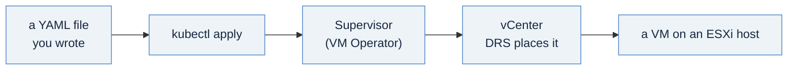

# Your first VM, by hand: the object a template wraps

[00-reaching-the-supervisor](./00-reaching-the-supervisor.md) gave you a context.
[01-before-you-start](./01-before-you-start.md) explained what kind of organization you are in and
which dialect the templates speak. This page is the step between those and the templates themselves:
you build one virtual machine with `kubectl`, watch vSphere produce it, reach it over the network,
and delete it. It takes about five minutes of waiting and three commands.

Do it before template 1 and template 1 stops being two new ideas at once. A cloud template that
builds a VM is a wrapper around a Kubernetes object; if you have never seen the object on its own,
the wrapper and the thing wrapped arrive together and blur. Build the object first and template 1
reads as "the same thing, submitted for me".

## The one idea

Nothing about vSphere went away. The machine you are about to create lands on the same vCenter, gets
placed by the same DRS, and writes to the same datastore as every VM you have ever built. What
changed is where the request goes. Instead of a wizard in the vSphere Client, you write down what
you want and hand it to an API:



That is the whole shift. The rest of this page is the mechanics.

## Step 1: find the three values only your estate can tell you

A VM manifest needs three things that are specific to where you are deploying: which **image** to
build from, which **class** decides its size, and which **storage class** its disk lives on. Nothing
else in the manifest changes between estates, which is why these three are the only placeholders.

Work from a per-namespace context, not the top-level one:

```bash
vcf context use <context-name>:<namespace>:<project>

kubectl get virtualmachineimages                  # the image  -> vmi-...
kubectl get virtualmachineclasses                 # the size   -> best-effort-small, ...
```

**Read the namespace-scoped image list, not the cluster-scoped one.**
[00-reaching-the-supervisor](./00-reaching-the-supervisor.md) explains why at length; the short
version is that `clustervirtualmachineimages` is where a VKS estate keeps its Kubernetes **node**
images, so searching it for Ubuntu returns a long list of things that are not what you want. If a
`vmi-` id's display name carries a Kubernetes version, it is a node image.

Storage classes are the one value with no obvious list command from inside a namespace, because
`kubectl get storageclass` is a cluster-scoped read and your tenant identity is refused it. Two ways
to get it:

```bash
kubectl get regionstorageclassquotas              # from the TOP-LEVEL context: what you are entitled to
kubectl get pvc -o custom-columns=NAME:.metadata.name,CLASS:.spec.storageClassName   # what is in use here
```

### The shortcut worth learning

If anything already runs in your namespace, copy its combination rather than assembling one:

```bash
kubectl get vm -o custom-columns=\
NAME:.metadata.name,CLASS:.spec.className,IMAGE:.spec.imageName,STORAGE:.spec.storageClass
```

```
NAME                      CLASS               IMAGE                  STORAGE
app-db-01                 best-effort-small   vmi-0000000000000      my-storage-class
```

Those three values are known to work together on this estate, because a machine is running on them
right now. Starting from a proven triple removes the most common first-attempt failure, which is a
class, an image and a storage class that are each individually valid and not available in
combination in your namespace.

## Step 2: the manifest

Three objects. Save this as `hello-vm.yaml` and fill in the four `<REPLACE_ME-...>` values.

```yaml
# hello-vm: a virtual machine declared as Kubernetes objects.
---
apiVersion: v1
kind: Secret
metadata:
  name: hello-vm-bootstrap
type: Opaque
stringData:
  # cloud-init. The machine configures itself on first boot, so nothing has to log in
  # and build it. This is the difference between a VM you made and a VM you can remake.
  user-data: |
    #cloud-config
    users:
      - name: demo
        sudo: ALL=(ALL) NOPASSWD:ALL
        shell: /bin/bash
        lock_passwd: false
        ssh_authorized_keys:
          - <REPLACE_ME-your-ssh-public-key>      # cat ~/.ssh/id_ed25519.pub
    package_update: true
    packages: [nginx]
    runcmd:
      - [systemctl, enable, --now, nginx]
      - [bash, -c, "echo '<h1>Built by kubectl, run by vSphere</h1>' > /var/www/html/index.html"]
---
apiVersion: vmoperator.vmware.com/v1alpha5
kind: VirtualMachine
metadata:
  name: hello-vm
  labels:
    app.kubernetes.io/name: hello-vm
spec:
  # WHAT to build from. A vmi- id rather than a friendly name: the id is immutable, so
  # this file produces the same machine next month. A display name is not a contract.
  image:
    kind: VirtualMachineImage
    name: <REPLACE_ME-vm-image>
  imageName: <REPLACE_ME-vm-image>

  # HOW BIG. A named class, not a CPU and memory pair. The platform team owns what the
  # classes mean, so a consumer never picks a number the platform has to live with.
  className: <REPLACE_ME-vm-class>

  # WHERE the disk lives. A storage class maps to a vSphere storage policy.
  storageClass: <REPLACE_ME-storage-class>

  powerState: PoweredOn

  bootstrap:
    cloudInit:
      rawCloudConfig:
        name: hello-vm-bootstrap
        key: user-data
---
# A front door. This is where the model stops resembling the vSphere Client, because a
# VM and a Service are the same kind of object here: the load balancer allocates an
# external address and points it at the machine's port 80.
apiVersion: vmoperator.vmware.com/v1alpha5
kind: VirtualMachineService
metadata:
  name: hello-vm-web
spec:
  type: LoadBalancer
  selector:
    app.kubernetes.io/name: hello-vm
  ports:
    - name: http
      port: 80
      targetPort: 80
      protocol: TCP
```

Four things in that file are worth pausing on.

**There is no `networks:` block.** In the Supervisor model a VM gets a NIC on its namespace's network
automatically. You declare networking only when you need something other than that default, which is
what template 3 introduces.

**There is no boot-disk size.** The machine gets whatever disk the image carries. `spec.bootDiskCapacity`
reads like the field for it and is not one: the running API does not accept it at any version, and the
real field, `spec.advanced.bootDiskCapacity`, was measured on a 9.1 estate leaving the machine unable
to power on. Size your namespace quota to the image rather than trying to size the image to the quota,
and check what your first machine actually gets.

**The selector is a label, not a name.** `hello-vm-web` finds its VM the same way a Kubernetes Service
finds Pods. That is why the label on the VM matters: change it and the front door points at nothing.

**The password is not in the file.** An SSH public key is not a secret, so it can live in a manifest
you commit. If you want console access instead, generate a hash with `openssl passwd -6` on your own
machine and use `passwd:` rather than a plaintext `chpasswd`.

## Step 3: prove it before you build it

```bash
kubectl apply -f hello-vm.yaml --dry-run=server
```

```
secret/hello-vm-bootstrap created (server dry run)
virtualmachine.vmoperator.vmware.com/hello-vm created (server dry run)
virtualmachineservice.vmoperator.vmware.com/hello-vm-web created (server dry run)
```

`--dry-run=server` sends the manifest to the real API and asks it to validate and discard. It catches
a misspelled field, an image that is not in this namespace, and a quota that will not fit, without
creating anything. Make it a habit now: it is the same habit that protects a production apply later.

## Step 4: build it

```bash
kubectl apply -f hello-vm.yaml
```

Then watch. The useful detail here is that `-o wide` does **not** show you an address:

```bash
kubectl get vm hello-vm -o wide
```

```
NAME       POWER-STATE   AGE
hello-vm   PoweredOn     2m27s
```

The address lives at `status.network.primaryIP4`, so ask for it by path:

```bash
kubectl get vm hello-vm -o jsonpath='{.status.powerState}{"  "}{.status.network.primaryIP4}{"\n"}'
```

```
PoweredOn  192.0.2.41
```

When something is slow, the conditions say why, and they are readable:

```bash
kubectl get vm hello-vm -o jsonpath='{range .status.conditions[?(@.status!="True")]}{.type}{"  "}{.reason}{"\n"}{end}'
```

Expect a few to be False for the first minute or two while the disk is attached and the guest boots.
`VirtualMachineHardwareVolumesVerified` reporting a missing volume during that window is normal and
clears itself. What matters is that the list empties.

## Step 5: reach it

```bash
kubectl get vmservice hello-vm-web -o jsonpath='{.status.loadBalancer.ingress[0].ip}{"\n"}'
curl http://<that-address>/
```

```
<h1>Built by kubectl, run by vSphere</h1>
```

That page did not exist when you ran `apply`. cloud-init installed nginx and wrote it on first boot,
from the Secret you declared. Nothing logged in to the machine at any point.

## Step 6: tear it down, and check

Deleting is the half people skip, and it is the half that decides whether your namespace quota is
still there next week.

```bash
kubectl delete -f hello-vm.yaml
```

`delete -f` is the mirror of `apply -f`: the same file names the same objects, so nothing is left
behind because you forgot it existed. Then confirm rather than assume:

```bash
kubectl get vm,vmservice,secret,pvc | grep hello-vm     # expect no output
```

Two things are worth knowing about what just happened:

- **The boot-disk volume goes with the VM.** You never created it; the VM Operator did, and it owns
  it. It is reclaimed automatically. A PVC that you create yourself for application data is a
  different matter: that one outlives the VM by design, and deleting the VM leaves it and its quota
  behind. That distinction is the single most common source of a namespace that is mysteriously out
  of storage.
- **The load-balancer address is released.** Curl the address after the delete and it stops answering.
  External addresses are a finite pool; a forgotten `VirtualMachineService` holds one indefinitely.

If `grep` returns something, wait fifteen seconds and look again before worrying. Deletion is
asynchronous and a VM with a powered-on guest takes a moment.

## Two things that will bite you

**`the server has asked for the client to provide credentials`.** This is the most common error on
this page and it is not about your manifest. The token in your `~/.kube/config` is short-lived, an
hour on the estate this was written against, and it expires quietly. Re-vend the context and the same
command works:

```bash
vcf context delete <context-name> --yes
vcf context create <context-name> \
    --endpoint https://<automation-fqdn> --type cci \
    --api-token "$TOKEN" --tenant-name <Tenant> --insecure-skip-tls-verify
```

Delete then create, rather than `vcf context refresh`: refresh re-runs context creation and prompts
for input, which is fine at a terminal and a hang in a script.

**A field the server ignores looks exactly like a field it honours.** `kubectl apply` rejects an
unknown field outright, which is what you want and why `--dry-run=server` is worth the extra command.
Most other API clients, including the one VCF Automation uses to apply a template's manifest for you,
default to discarding unknown fields silently and returning success. The same manifest can therefore
fail loudly by hand and succeed hollowly through a template, having quietly dropped the line you
cared about. When a manifest travels through anything other than `kubectl`, read the object back and
check that what you asked for is in it. Not the response code: the stored object.

```bash
kubectl get vm hello-vm -o yaml | head -40      # what the server actually kept
```

## What you just did, and where it goes

Everything on this page is what template 1 automates. Lined up:

| You wrote | Template 1 has | What the template adds |
|---|---|---|
| the `VirtualMachine` object | the same object inside `CCI.Supervisor.Resource` | a catalog form, inputs, a project scope |
| the image, class and storage class you looked up | the same three as **inputs** | one template deploys on any estate |
| `kubectl apply` | **Deploy** in the catalog, or an API call | governance, approval, a deployment record |
| `kubectl delete -f` | **Delete** on the deployment | the whole set goes at once, by construction |

The trade is visible now that you have done both. By hand you get directness and no ceremony. Through
a template you get a form someone else can fill in safely, a record of who asked for what, and the
ability to change one file and have every future deployment follow. Neither replaces the other:
platform engineers live in the first, and build the second for everyone else.

## Next

[`templates/01-single-vm/`](./templates/01-single-vm/) wraps the object you just built into a cloud
template. Its `single-vm.vm.yaml` is deliberately the same shape as the manifest above, so read the
two side by side.
